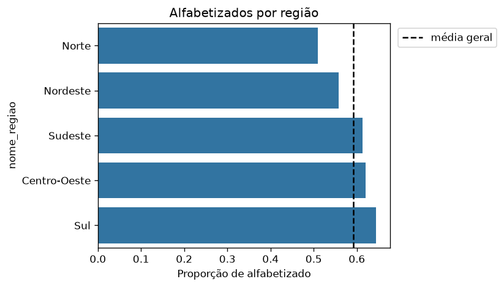
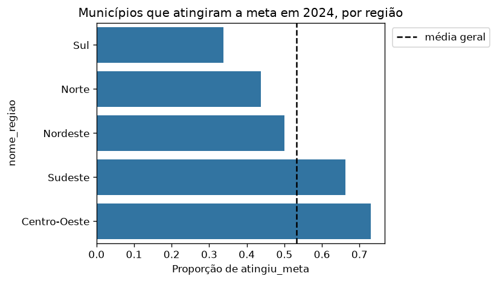

# Predição e inteligência analítica para alfabetização no Brasil

Tech Challenge da Fase 3 da pós-graduação em AI Scientist da FIAP (Pós Tech). A partir da camada Gold construída na Fase 2, o projeto analisa e modela o Indicador Criança Alfabetizada para apoiar decisões de políticas públicas educacionais.

> **Estado do projeto.** Este README descreve o que já está no repositório. A modelagem supervisionada final, a interpretação com SHAP, o agrupamento de municípios e as respostas às perguntas de negócio ainda não foram entregues aqui, e as seções delas dizem isso. **Nenhum número abaixo é resultado de um modelo final.** O único modelo no repositório é um baseline provisório, descartável (ver [Baseline provisório](#baseline-provisório)).

## Sumário

- [Estado das etapas](#estado-das-etapas)
- [Contexto do problema](#contexto-do-problema)
- [Objetivo analítico](#objetivo-analítico)
- [Estrutura do repositório](#estrutura-do-repositório)
- [Como rodar](#como-rodar)
- [Descrição da base utilizada](#descrição-da-base-utilizada)
- [Etapas de modelagem](#etapas-de-modelagem)
- [Escolha do algoritmo](#escolha-do-algoritmo)
- [Métricas de avaliação](#métricas-de-avaliação)
- [Interpretação dos resultados](#interpretação-dos-resultados)
- [Insights encontrados](#insights-encontrados)
- [Limitações do projeto](#limitações-do-projeto)
- [Aplicação prática para políticas públicas](#aplicação-prática-para-políticas-públicas)
- [Possíveis evoluções futuras](#possíveis-evoluções-futuras)
- [Decisões e exceções ao que foi ensinado](#decisões-e-exceções-ao-que-foi-ensinado)
- [Práticas de desenvolvimento](#práticas-de-desenvolvimento)

## Estado das etapas

| Etapa | Estado |
|---|---|
| Dados: snapshot da Gold, exportador e leitor | Pronto |
| Análise exploratória e dicionário de dados | Pronta |
| Pré-processamento: tabelas de modelagem, colunas proibidas e pré-processador | Pronto |
| Baseline provisório (caminho ponta a ponta) | Pronto, descartável |
| Separação por município, validação cruzada, busca de hiperparâmetros e comparação de modelos | Ainda não entregue aqui |
| Interpretação (Feature Importance e SHAP) | Ainda não entregue |
| Agrupamento de municípios | Ainda não entregue |
| Respostas às perguntas de negócio, documentação técnica e vídeo executivo | Ainda não entregues |

## Contexto do problema

Segundo o README da Fase 2 deste grupo, o Compromisso Nacional Criança Alfabetizada é uma política pública (União, estados, Distrito Federal e municípios) que busca garantir que toda criança brasileira esteja alfabetizada até o fim do 2º ano do ensino fundamental, com meta de 100% até 2030. O Indicador Criança Alfabetizada mede o percentual de estudantes que atingem o corte de 743 pontos na escala Saeb. Os dados vêm da Pesquisa Alfabetiza Brasil, do INEP.

O enunciado destaca que conhecer só os dados atuais não basta: gestores públicos precisam antecipar riscos, identificar regiões vulneráveis e entender quais fatores têm maior impacto nos indicadores. A Fase 2 entregou o pipeline de engenharia de dados e a camada Gold; esta fase usa essa camada para construir análises e modelos de Machine Learning.

## Objetivo analítico

Desenvolver um modelo supervisionado que preveja se um aluno será considerado alfabetizado ou não, usando variáveis educacionais, territoriais e socioeconômicas, e transformar isso em inteligência aplicável. O projeto responde às cinco perguntas de negócio do enunciado:

1. Quais fatores mais impactam a alfabetização?
2. Quais municípios apresentam maior risco educacional?
3. Quais regiões possuem padrões semelhantes?
4. Como prever municípios que podem não atingir metas futuras?
5. Quais variáveis têm maior influência nos modelos?

O trabalho se organiza em quatro trilhas: **T1**, modelo supervisionado do aluno (`alfabetizado`); **T2**, modelo supervisionado do município (`atingiu_meta`, só 2024); **T3**, agrupamento de municípios; **T4**, interpretação (Feature Importance e SHAP). A classe de risco é sempre a positiva: *não alfabetizado* e *não atingiu a meta*.

O projeto segue apenas o que foi ensinado nas aulas; o que o enunciado exige e as aulas não cobrem está marcado em [Decisões e exceções](#decisões-e-exceções-ao-que-foi-ensinado).

## Estrutura do repositório

```
data/                     snapshot da Gold em Parquet (9 tabelas) e data/README.md com a origem
notebooks/                01_esqueleto_baseline.ipynb e 02_eda.ipynb
src/
  config.py               semente única, caminhos, tabelas da Gold e colunas por trilha
  preprocessing/          leitor e exportador do snapshot, dicionário de dados, tabelas, colunas proibidas e pré-processador
  modeling/               baseline provisório
  evaluation/             (ainda vazio)
  visualization/          histograma, barras do alvo e mapa de correlação
tests/                    testes com pytest
reports/                  dicionário de dados, resultado do baseline e fragmentos de documentação
images/                   figuras da análise exploratória
requirements.txt          dependências com versões fixas
```

## Como rodar

Testado com **Python 3.12**.

```bash
python3.12 -m venv .venv
source .venv/bin/activate
pip install -r requirements.txt

python -m pytest -q                       # suíte de testes
python -m src.preprocessing.qualidade     # regenera reports/dicionario_dados.md
python -m src.modeling.baseline           # baseline provisório (grava reports/baseline_provisorio.json)
```

Os notebooks em `notebooks/` abrem em qualquer editor com suporte a Jupyter (o ambiente já traz o `ipykernel`) e leem o snapshot de `data/`, sem credencial.

Para regenerar o snapshot a partir do BigQuery é preciso ter a Gold da Fase 2 criada no seu projeto GCP e credencial de aplicação somente leitura (`gcloud auth application-default login`):

```bash
GCP_PROJECT_ID=<id-do-projeto> python -m src.preprocessing.export_gold
```

Os detalhes da origem dos dados e da regeneração estão em [data/README.md](data/README.md).

## Descrição da base utilizada

A base é a camada Gold da Fase 2: o dataset `alfabetizacao_analytics` do BigQuery, construído sobre `basedosdados.br_inep_avaliacao_alfabetizacao` (Pesquisa Alfabetiza Brasil, INEP). Uma cópia em Parquet das 9 tabelas (cerca de 30 MiB) está em `data/`, e o projeto lê essa cópia, sem credencial GCP.

| Tabela | Grão | Linhas |
|---|---|---|
| `fact_alunos` | aluno | 3.867.999 |
| `fact_meta_resultado_municipio` | município, rede, ano | 10.698 |
| `fact_indicador_municipio` | ano, município, série, rede | 23.995 |
| `fact_alfabetizacao_municipio` | ano, município, rede, série | 23.995 |
| `dim_municipio` | município | 5.571 |
| `dim_rede`, `dim_serie`, `dim_tempo`, `dim_uf` | dimensões | 5, 1, 8 e 27 |

O que a verificação do snapshot mostrou (detalhes em [data/README.md](data/README.md) e no dicionário em [reports/dicionario_dados.md](reports/dicionario_dados.md)):

- **Anos reais:** só 2023 e 2024. Não há 2025 nem eventos sintéticos do streaming da Fase 2: a Gold foi recriada só com o pipeline batch, e nenhuma tabela de fato tem ano fora de 2023 e 2024.
- **Alvo do aluno:** `alfabetizado` é exatamente `proficiencia >= 743`, verificado nos 3.354.661 alunos com proficiência.
- **Quem não fez a prova:** 513.338 alunos (13,3%) deixaram o caderno em branco; têm `proficiencia` nula e `alfabetizado` falso por ausência, não por leitura. Por isso o modelo do aluno só usa quem fez a prova.
- **Alvo do município:** `atingiu_meta` só existe para 2024: 2.782 atingiram, 2.444 não e 120 são nulos. Todos os rótulos são da rede municipal.
- **Faltantes:** 5 colunas de `fact_alfabetizacao_municipio` são 100% nulas; as `proporcao_aluno_nivel_*` são nulas em cerca de 48% das linhas (em 2023, em todas) e por isso não são usadas; 6 dos 5.571 municípios não têm IDHM.
- **Ruído por município:** a mediana é de 122 alunos por município em 2024 (mínimo 10), então a taxa municipal é estimada de poucos alunos. Os alunos de um município compartilham os mesmos atributos municipais, o que exige separar treino e teste por município.

**A fonte é um snapshot local por escolha, não por limitação.** A Gold da Fase 2 é efêmera (a infraestrutura é destruída depois do uso para não gerar custo) e recriá-la levou de 25 a 30 minutos. O snapshot permite que qualquer pessoa rode o projeto sem projeto GCP, com os mesmos dados em toda execução. O custo é um repositório maior (o maior arquivo tem 29,1 MiB, e cada regeneração acrescenta cerca de 30 MiB ao histórico) e uma cópia que fica desatualizada se a Gold mudar. Isso poderia ser trocado para leitura direta do BigQuery sem mexer no resto do código: `carregar_tabela`, em `src/preprocessing/loader.py`, é o único ponto de leitura, e o pipeline da Fase 2 recria a Gold. A nota de design está no próprio módulo.

## Etapas de modelagem

**Feito até aqui:**

1. **Tabela do aluno (T1).** `construir_tabela_aluno` entrega atributos, alvo e grupo alinhados: 3.354.661 alunos de 5.547 municípios, 40,8% não alfabetizados (classe positiva = risco). Os atributos são `rede`, `caderno` e os municipais (UF, região, capital, IDHM e seus três componentes). Nada do resultado do próprio aluno entra.
2. **Tabela do município (T2).** `construir_tabela_municipio` entrega 5.226 municípios da rede municipal com rótulo em 2024, 2.444 deles (46,8%) que não atingiram a meta. Os atributos são anteriores ao resultado: taxa e média de Português de 2023, a meta de 2024 (conhecida de antemão), a folga entre a taxa de 2023 e essa meta e os atributos municipais. Nada de 2024 além da meta entra.
3. **Colunas proibidas.** `ColunasTrilha`, em `src/config.py`, lista por trilha o que pode ser atributo e o que nunca pode (resultado do aluno, `presenca` e `preenchimento_caderno`, indicadores do mesmo ano, identificadores). `validar_atributos` falha com `ValueError` se uma coluna proibida aparecer.
4. **Perfil dos municípios para o agrupamento.** `construir_atributos_municipio` entrega uma linha por município (5.352), com IDHM e componentes, capital e taxas de 2023 e 2024.
5. **Pré-processador.** `construir_preprocessador` devolve um `ColumnTransformer` não ajustado: imputação pela mediana, padronização opcional e One-Hot, com saída em `DataFrame`. Quem o usa o encaixa num `Pipeline`, e então mediana, média, desvio e categorias vêm só do treino. As decisões estão em [reports/readme-escalonamento.md](reports/readme-escalonamento.md).

**Ainda não entregue:** separação em treino, validação e teste por município, validação cruzada agrupada, comparação de modelos, busca de hiperparâmetros, curva de aprendizado e diagnóstico de overfitting. O plano é sortear municípios (não alunos) para cada conjunto e usar `GroupKFold` na validação cruzada, para que nenhum município apareça em dois conjuntos.

### Baseline provisório

`python -m src.modeling.baseline` prova o caminho completo, do snapshot a uma métrica, e **não é resultado do projeto**. Ele compara um `DummyClassifier` e uma Regressão Logística, ambos dentro de um `Pipeline`, com `train_test_split` 80/20 estratificado:

| Modelo | AUC-ROC (validação) |
|---|---|
| Dummy | 0,500 |
| Regressão Logística | 0,627 |

Este número **não deve ser lido como desempenho do modelo do aluno**, por dois motivos de fato:

- **A separação não é por município.** O mesmo município cai no treino e na validação, e os atributos municipais o identificam; a AUC-ROC sai otimista.
- **A população é outra.** O baseline usa os 3.867.999 alunos, inclusive os 513.338 de caderno em branco, e trata esses alunos como "não alfabetizados" (48,7% de positivos). A tabela de T1 exclui esse grupo (40,8% de positivos). Os dois números não são comparáveis entre si.

Ele será substituído pelo modelo de verdade e fica no repositório só como registro do esqueleto.

## Escolha do algoritmo

Ainda não entregue. O que está decidido para a próxima etapa: comparar Regressão Logística, Random Forest e Gradient Boosting contra o `DummyClassifier`, escolhendo pela AUC-ROC média de validação cruzada, nunca pelo teste. O algoritmo e a justificativa entram nesta seção quando o resultado existir.

## Métricas de avaliação

Métrica principal: **AUC-ROC**, usada para escolher o modelo e ajustar hiperparâmetros (Aulas de Supervisionados 7 e Otimização 4). Acompanham, para a classe positiva (o risco), AUC-PR, precisão, recall, F1 e a matriz de confusão no limiar de 0,5. O módulo `src/evaluation/` que as calcula ainda não foi entregue.

Regra do diagnóstico de overfitting, a ser aplicada na validação antes de abrir o teste: erro = 1 − AUC-ROC, e uma razão de erro validação/treino de 2 ou mais marca overfitting (Aula de Otimização 5).

## Interpretação dos resultados

Ainda não entregue. O plano é Feature Importance, Permutation Importance e SHAP sobre o modelo final, lembrando que a interpretação descreve associação nos dados, não o efeito de uma política.

## Insights encontrados

Os achados abaixo vêm da análise exploratória ([notebooks/02_eda.ipynb](notebooks/02_eda.ipynb)) e são **descritivos, não causais**. Não vêm de um modelo.

- **Há gradiente por região e por IDHM, mas modesto.** Entre os alunos que fizeram a prova, a proporção de alfabetizados vai de 50,9% no Norte a 64,5% no Sul, e de 55,1% no quintil mais baixo de IDHM a 60,8% no mais alto.
- **O Sul tem a maior proporção de alfabetizados e a menor de municípios que atingiram a meta (33,8%).** A meta de cada município parece crescer com o ponto de partida.
- **A meta de 2024 é quase uma função da taxa de 2023** (correlação de 0,98), e a taxa de 2024 só se correlaciona 0,64 com a de 2023.
- **Nenhuma variável isolada discrimina `atingiu_meta`:** a AUC-ROC bruta de cada uma fica entre 0,48 e 0,50. Isso antecipa que o modelo do município terá pouco poder de previsão, o que combina com a AUC-ROC de 0,570 que o projeto da Fase 2 obteve.
- **O IDHM e seus três componentes são redundantes** (correlação de 0,71 a 0,95).
- **A rede praticamente não varia entre os alunos que fizeram a prova:** 24 alunos de rede privada entre 3,35 milhões.




A EDA termina com uma tabela de cinco hipóteses, uma por pergunta de negócio, cada uma ligada a uma decisão de modelagem. Elas serão testadas nas etapas de modelagem e de interpretação.

## Limitações do projeto

- **Dados de dois anos só.** A Gold tem 2023 e 2024, e o rótulo de `atingiu_meta` existe só para 2024; não há como validar o modelo do município em outro ano.
- **Atributos do aluno são todos do município.** Dois alunos do mesmo município, rede e caderno têm os mesmos atributos, então a previsão individual é limitada pelo que se sabe do território.
- **Poucos alunos por município** (mediana de 122 em 2024) tornam a taxa municipal ruidosa.
- **Associação, não causa.** Nenhuma análise deste projeto estima o efeito de uma política.
- **Snapshot local:** os dados não acompanham mudanças na Gold da Fase 2 até alguém rodar o exportador.
- **Resultados de modelagem ainda não entregues:** as limitações de desempenho dos modelos finais entram aqui quando houver resultados.

## Aplicação prática para políticas públicas

Ainda não entregue. Depende dos resultados do modelo do município, do ranking de risco, do agrupamento e da interpretação.

## Possíveis evoluções futuras

- Ler a Gold direto do BigQuery, se o projeto GCP ficar ativo (ver a nota na seção da base).
- Incluir atributos do aluno ou da escola se a Gold os trouxer.
- Repetir o modelo do município quando houver mais de um ano com rótulo.

## Decisões e exceções ao que foi ensinado

O projeto segue só o que foi ensinado nas aulas. As exceções abaixo são exigidas pelo enunciado e não aparecem nas aulas, ou são escolhas do time:

| Item | Situação |
|---|---|
| `SimpleImputer`, `ColumnTransformer`, `Pipeline`, `GroupKFold`, `DummyClassifier` | Exigidos pelo enunciado, não cobertos nas aulas |
| Mediana como estratégia de imputação | Decisão do time (a imputação é exigida, a estratégia não é ensinada) |
| `pytest` | Escolha do time |
| Parquet para o snapshot, `google-cloud-bigquery` para exportar | Escolha do time |
| Classe positiva = risco (não alfabetizado, não atingiu a meta) | Decisão do time |
| Sem seleção de atributos | Decisão do time (o enunciado só a exige "se usada") |
| Semente 42 em todo o projeto | Valor que o código das aulas usa |

## Práticas de desenvolvimento

- **Um repositório, uma branch por assunto.** Prefixos `feat/` para funcionalidade, `fix/` para correção, e `chore/`, `docs/` e `test/` para o restante. Cada branch vira um Pull Request, e os PRs são mesclados com merge commit.
- **Commits pequenos, em português,** no formato `tipo(escopo): descrição`.
- **Testes primeiro.** Onde há lógica nova, o commit dos testes vem antes do da implementação, e o primeiro falha de propósito. Por isso alguns commits intermediários não passam na suíte sozinhos; o topo de cada PR passa.
- **Dependências com versões fixas** em `requirements.txt`; semente única em `src/config.py`.
- **Sem segredos no repositório:** `.env`, chaves e credenciais estão no `.gitignore`, e o acesso ao BigQuery usa só credencial de aplicação somente leitura.
